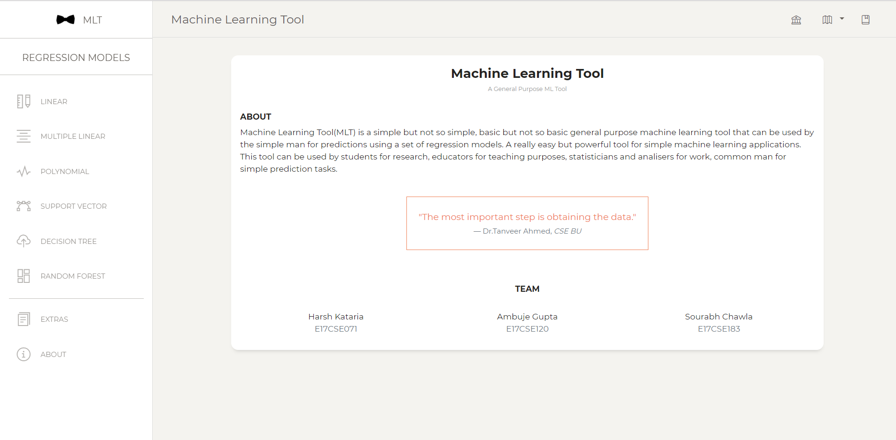

# MLT
Machine Learning Tool

Machine Learning Tool(MLT) is a simple but not so simple, basic but not so basic general purpose machine learning tool that can be used by the simple man for predictions using a set of regression models. A really easy but powerful tool for simple machine learning applications. This tool can be used by students for research, educators for teaching purposes, statisticians and analisers for work, common man for simple prediction tasks.

Backend has been done on python library Djano.
Technologies used - python3.6 , sklearn.

### Home Screenshot

### Django Directories

This is also a web app and can work on your phone by pressing "Add To home screen"

Collaborator - https://github.com/rockangator 

